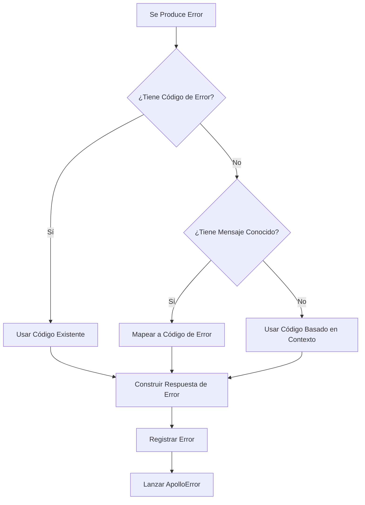

# Guía de Manejo de Errores

## Tabla de Contenidos
- [Descripción General](#descripción-general)
- [Implementación del Manejador de Errores](#implementación-del-manejador-de-errores)
- [Categorías de Códigos de Error](#categorías-de-códigos-de-error)
- [Códigos de Error Detallados](#códigos-de-error-detallados)
- [Manejo de errores basado en contexto](#manejo-de-errores-basado-en-contexto)
- [Mejores prácticas](#mejores-prácticas)

## Descripción General

Este documento describe el sistema de manejo de errores implementado en el proyecto deuna-msa-nb-gql. El sistema proporciona una forma estandarizada de manejar y reportar errores en toda la aplicación, utilizando códigos de error únicos y mensajes de error consistentes.

## Implementación del manejador de errores

El sistema de manejo de errores se implementa a través de dos componentes principales:

1. **Clase ErrorHandler** (`src/utils/error-handler.util.ts`):
    - Proporciona funcionalidad centralizada para el manejo de errores
    - Mapea mensajes de error a códigos de error estandarizados
    - Registra errores con contexto detallado
    - Lanza ApolloError con formato estandarizado

2. **Códigos de Error** (`src/common/constants/error-codes.ts`):
    - Define todos los códigos de error posibles en el sistema
    - Organizados por categoría con rangos numéricos
    - Utiliza el prefijo 'NB_ERR_' para todos los códigos

### Formato de Respuesta de Error

```typescript
interface ErrorResponse {
  code: string;        // Standardized error code
  message: string;     // Human-readable error message
  context?: string;    // Error context/location
  details?: any;       // Additional error details
}
```

## Categorías de Códigos de Error

🔐 **Authentication (000-099)**
📋 **Onboarding (100-199)**
👤 **Client (200-299)**
📄 **Document (300-399)**
📑 **Contract (400-499)**
💰 **Billing (500-599)**
📨 **Notification (600-699)**
📁 **File Upload (700-799)**
🏦 **CNB (800-899)**
⚙️ **System (900-999)**
⭐ **Calification (1000-1099)**
💸 **Transaction (1100-1199)**

## Códigos de error detallados

### 🔐 Authentication Errors (000-099)
| Code | ID | Description |
|------|------|-------------|
| NB_ERR_001 | AUTH_TOKEN_INVALID | Invalid or missing authentication token |
| NB_ERR_002 | AUTH_SESSION_EXPIRED | User session has expired |
| NB_ERR_003 | AUTH_OTP_INVALID | Invalid OTP code provided |
| NB_ERR_004 | AUTH_OTP_EXPIRED | OTP code has expired |
| NB_ERR_005 | AUTH_USER_NOT_FOUND | User not found in the system |
| NB_ERR_006 | AUTH_OTP_VALIDATION_FAILED | Failed to validate OTP |
| NB_ERR_007 | AUTH_OTP_REQUEST_INVALID | Invalid OTP request format or content |
| NB_ERR_008 | AUTH_OTP_UPDATE_FAILED | Failed to update OTP status in system |

### 📋 Onboarding Errors (100-199)
| Code | ID | Description |
|------|------|-------------|
| NB_ERR_101 | ONB_STATUS_INVALID | Invalid onboarding status |
| NB_ERR_102 | ONB_STEP_INVALID | Invalid or non-existent onboarding step |
| NB_ERR_103 | ONB_GET_SESSION_FAIL | Onboarding session has expired |
| NB_ERR_104 | ONB_DATA_INCOMPLETE | Required onboarding data is missing |
| NB_ERR_105 | ONB_FLOW_BLOCKED | Onboarding flow is blocked or paused |
| NB_ERR_106 | ONB_STATUS_NOT_FOUND | No found data in onboarding status |
| NB_ERR_107 | ONB_SESSION_INVALID | Sesion Id empty or invalid |

### 👤 Client Errors (200-299)
| Code | ID | Description |
|------|------|-------------|
| NB_ERR_201 | CLIENT_ID_INVALID | Invalid client identifier |
| NB_ERR_202 | CLIENT_STATUS_INVALID | Invalid client status |
| NB_ERR_203 | CLIENT_DATA_MISSING | Required client data is missing |
| NB_ERR_204 | CLIENT_TYPE_INVALID | Invalid client type specified |
| NB_ERR_205 | CLIENT_UPDATE_FAILED | Failed to update client information |
| NB_ERR_206 | CLIENT_BLOCKED_TMP_OTP | Client Blocked temporarily for validation OTP|

### 📄 Document Errors (300-399)
| Code | ID | Description |
|------|------|-------------|
| NB_ERR_301 | DOC_FORMAT_INVALID | Invalid document format |
| NB_ERR_302 | DOC_SIZE_EXCEEDED | Document size exceeds limit |
| NB_ERR_303 | DOC_TYPE_INVALID | Invalid document type |
| NB_ERR_304 | DOC_UPLOAD_FAILED | Failed to upload document |
| NB_ERR_305 | DOC_SIGN_FAILED | Failed to sign document |

### 📑 Contract Errors (400-499)
| Code | ID | Description |
|------|------|-------------|
| NB_ERR_401 | CONTRACT_SIGN_PENDING | Contract signature is pending |
| NB_ERR_402 | CONTRACT_SIGN_EXPIRED | Contract signing period has expired |
| NB_ERR_403 | CONTRACT_DATA_INVALID | Invalid contract data |
| NB_ERR_404 | CONTRACT_TYPE_INVALID | Invalid contract type |
| NB_ERR_405 | CONTRACT_STATUS_INVALID | Invalid contract status |
| NB_ERR_406 | CONTRACT_SIGN_FAILED | Failed to sign contract |
| NB_ERR_407 | CONTRACT_PROCESS_FAILED | Failed to process contract |

### 💰 Billing Errors (500-599)
| Code | ID | Description |
|------|------|-------------|
| NB_ERR_501 | BILL_AMOUNT_INVALID | Invalid billing amount |
| NB_ERR_502 | BILL_ACCOUNT_INVALID | Invalid billing account |
| NB_ERR_503 | BILL_STATUS_FAILED | Failed to update billing status |
| NB_ERR_504 | BILL_DATA_MISSING | Required billing data is missing |
| NB_ERR_505 | BILL_PROCESS_FAILED | Failed to process billing operation |

### 📨 Notification Errors (600-699)
| Code | ID | Description |
|------|------|-------------|
| NB_ERR_601 | NOTIF_SEND_FAILED | Failed to send notification |
| NB_ERR_602 | NOTIF_TYPE_INVALID | Invalid notification type |
| NB_ERR_603 | NOTIF_DATA_MISSING | Required notification data is missing |
| NB_ERR_604 | NOTIF_TEMPLATE_INVALID | Invalid notification template |
| NB_ERR_605 | NOTIF_CHANNEL_INVALID | Invalid notification channel |

### 📁 File Upload Errors (700-799)
| Code | ID | Description |
|------|------|-------------|
| NB_ERR_701 | FILE_UPLOAD_INVALID_TYPE | Invalid file type for upload |
| NB_ERR_702 | FILE_UPLOAD_EMPTY | Attempted to upload empty file |
| NB_ERR_703 | FILE_UPLOAD_PROCESSING_ERROR | Error processing uploaded file |
| NB_ERR_704 | FILE_UPLOAD_SIZE_EXCEEDED | File size exceeds allowed limit |
| NB_ERR_705 | FILE_UPLOAD_STREAM_ERROR | Error in file upload stream |
| NB_ERR_706 | FILE_UPLOAD_INVALID_FORMAT | Invalid file format |
| NB_ERR_707 | FILE_UPLOAD_NO_CONTENT | No content in upload request |
| NB_ERR_708 | FILE_UPLOAD_SERVICE_ERROR | File upload service error |

### 🏦 CNB Errors (800-899)
| Code | ID | Description |
|------|------|-------------|
| NB_ERR_801 | CNB_USER_NOT_FOUND | CNB user not found |
| NB_ERR_802 | CNB_CLIENT_NOT_FOUND | CNB client not found |
| NB_ERR_803 | CNB_NOT_PRECALIFIED | Client not pre-qualified |
| NB_ERR_804 | CNB_INVALID_STATUS | Invalid CNB status |
| NB_ERR_805 | CNB_SERVICE_ERROR | CNB service error |

### ⚙️ System Errors (900-999)
| Code | ID | Description |
|------|------|-------------|
| NB_ERR_901 | SYS_SERVICE_DOWN | System service is unavailable |
| NB_ERR_902 | SYS_TIMEOUT_EXCEEDED | System operation timeout |
| NB_ERR_903 | SYS_PROCESS_FAILED | System process failure |
| NB_ERR_904 | SYS_CONFIG_INVALID | Invalid system configuration |
| NB_ERR_905 | SYS_ERROR_UNKNOWN | Unknown system error |

### ⭐ Calification Errors (1000-1099)
| Code | ID | Description |
|------|------|-------------|
| NB_ERR_1001 | CALIFICATION_INVALID_RATING | Invalid rating value provided |
| NB_ERR_1002 | CALIFICATION_INVALID_USER | Invalid or missing user information |
| NB_ERR_1003 | CALIFICATION_INVALID_CONTEXT | Invalid calification context |
| NB_ERR_1004 | CALIFICATION_SERVICE_ERROR | Calification service error |
| NB_ERR_1005 | CALIFICATION_PROCESS_FAILED | Failed to process calification |

### 💸 Transaction Errors (1100-1199)
| Code | ID | Description |
|------|------|-------------|
| NB_ERR_1101 | TRANSACTION_AMOUNT_INVALID | Invalid or out of range transaction amount |
| NB_ERR_1102 | TRANSACTION_ID_INVALID | Invalid or missing transaction ID |
| NB_ERR_1103 | TRANSACTION_SESSION_INVALID | Invalid or expired transaction session |
| NB_ERR_1104 | TRANSACTION_DEVICE_INVALID | Unauthorized device or invalid information |
| NB_ERR_1105 | TRANSACTION_USER_INVALID | Unauthorized user or missing information |
| NB_ERR_1106 | TRANSACTION_LIMIT_EXCEEDED | Transaction limit exceeded |
| NB_ERR_1107 | TRANSACTION_SERVICE_ERROR | Transaction service error |
| NB_ERR_1108 | TRANSACTION_STATUS_INVALID | Invalid transaction status |
| NB_ERR_1109 | TRANSACTION_PROCESS_FAILED | Transaction processing failed |
| NB_ERR_1110 | BANK_NAME_INVALID | Failed to execute deposit transaction |
| NB_ERR_1111 | INITIATE_ACCOUNT_DEPOSIT_FAILED | Failed to execute deposit transaction |
| NB_ERR_1112 | TRANSACTION_USER_DATA_NOT_FOUND | Failed to execute deposit transaction |

## Uso del manejador de errores

### Uso básico

```typescript
try {
  // Your code here
} catch (error) {
  ErrorHandler.handleError(error, 'context-name');
}
```

### Mapeo de Errores

El 'ErrorHandler' mapea automáticamente los mensajes de error comunes a los códigos de error apropiados:

```typescript
const messageToErrorCode = new Map([
  ['Username is required', ErrorCodes.CLIENT_DATA_MISSING],
  ['User not found', ErrorCodes.CNB_USER_NOT_FOUND],
  ['Client not found', ErrorCodes.CNB_CLIENT_NOT_FOUND],
  ['Client not precalified', ErrorCodes.CNB_NOT_PRECALIFIED],
  ['Invalid client status', ErrorCodes.CNB_INVALID_STATUS],
  ['Error fetching user data', ErrorCodes.CNB_SERVICE_ERROR],
  ['Error fetching client data', ErrorCodes.CNB_SERVICE_ERROR],
  ['Invalid OTP', ErrorCodes.AUTH_OTP_VALIDATION_FAILED],
  ['Invalid OTP request', ErrorCodes.AUTH_OTP_REQUEST_INVALID],
  ['Failed to update OTP status', ErrorCodes.AUTH_OTP_UPDATE_FAILED],
  ['Invalid rating value', ErrorCodes.CALIFICATION_INVALID_RATING],
  ['Invalid user for calification', ErrorCodes.CALIFICATION_INVALID_USER],
  ['Invalid calification context', ErrorCodes.CALIFICATION_INVALID_CONTEXT],
  ['Calification service error', ErrorCodes.CALIFICATION_SERVICE_ERROR],
  ['Failed to process calification', ErrorCodes.CALIFICATION_PROCESS_FAILED],
]);
```

### Manejo de errores basado en contexto

Si un error no coincide con ningún mensaje predefinido, el sistema asignará un código de error basado en el contexto:

```typescript
const contextToErrorCode = new Map([
  ['auth', ErrorCodes.AUTH_TOKEN_INVALID],
  ['onboarding', ErrorCodes.ONB_STATUS_INVALID],
  ['client', ErrorCodes.CLIENT_DATA_MISSING],
  ['document', ErrorCodes.DOC_FORMAT_INVALID],
  ['contract', ErrorCodes.CONTRACT_DATA_INVALID],
  ['billing', ErrorCodes.BILL_PROCESS_FAILED],
  ['notification', ErrorCodes.NOTIF_SEND_FAILED],
  ['validate-cnb-state', ErrorCodes.CNB_SERVICE_ERROR],
  ['calification', ErrorCodes.CALIFICATION_SERVICE_ERROR],
  ['execute-deposit', ErrorCodes.TRANSACTION_SERVICE_ERROR],
]);
```

## Diagrama de flujo de errores



## Mejores prácticas

1. **Siempre proporcionar contexto**
   ```typescript
   ErrorHandler.handleError(error, 'auth-login');
   ```

2. **Incluir detalles relevantes**
   ```typescript
   throw {
     code: ErrorCodes.CLIENT_DATA_MISSING,
     message: 'Required client data missing',
     details: { missingFields: ['name', 'email'] }
   };
   ```

3. **Usar códigos de error predefinidos**
   - Siempre usar códigos de error del enum 'ErrorCodes'
   - No crear códigos de error personalizados fuera de los rangos definidos
   - Seguir los rangos por categoría para nuevos códigos de error

4. **Registro apropiado de errores**
   - El 'ErrorHandler' registra automáticamente los errores con contexto
   - El registro adicional debe realizarse antes de llamar a 'handleError' si es necesario
   - Incluir el contexto relevante de la solicitud en los registros