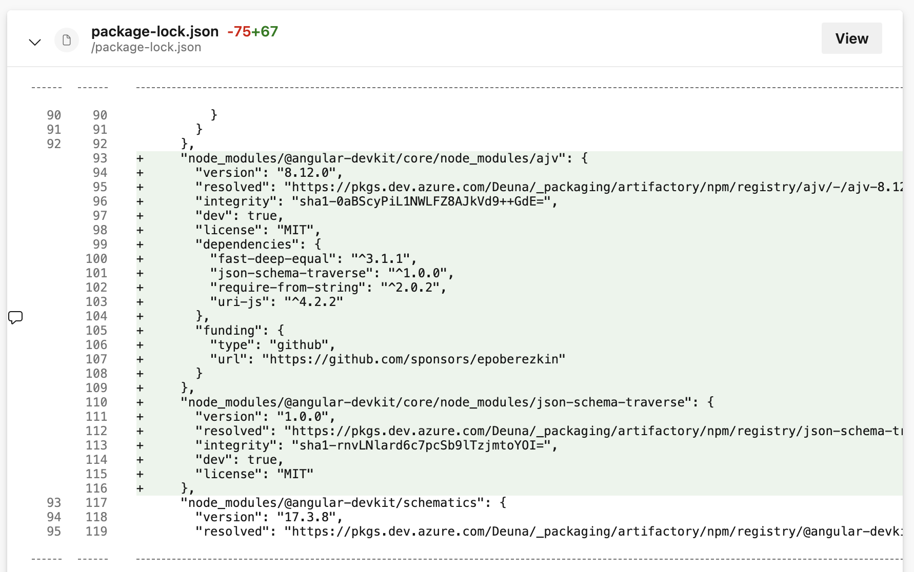
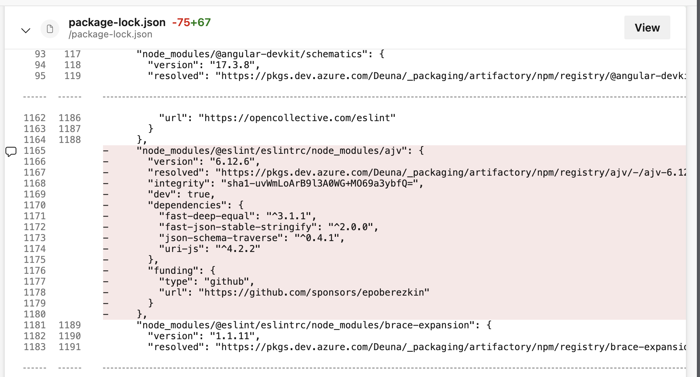
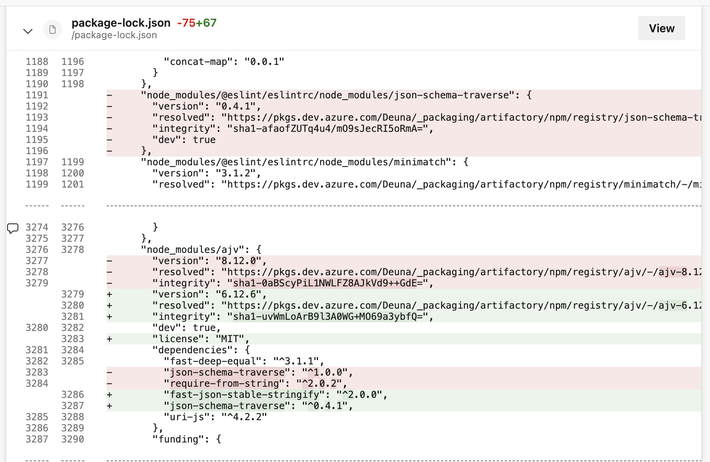
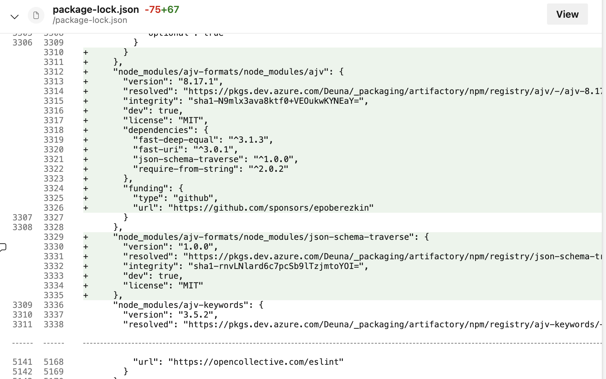
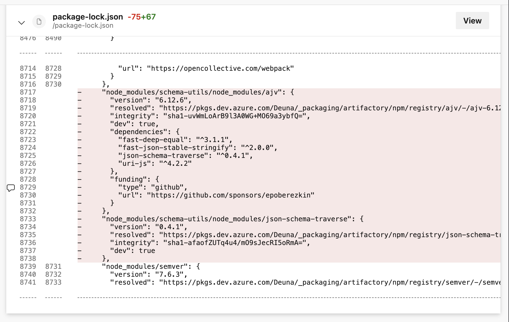

# Error de dependencias

El pipeline de CI muestra constantemente errores en el uso de las siguientes librerias:

- node_modules/@angular-devkit/core/node_modules/ajv
- node_modules/@angular-devkit/core/node_modules/json-schema-traverse
- node_modules/fast-uri

Se deben garantizar las siguientes versiones:

| Library | Version with Issue | Expected Library | Expected Version |
|---------|-------------------|------------------|-------------------|
| node_modules/@eslint/eslintrc/node_modules/ajv | 6.12.6 | node_modules/@angular-devkit/core/node_modules/ajv | 8.12.0 |
| node_modules/@eslint/eslintrc/node_modules/json-schema-traverse | 0.4.1 | node_modules/@angular-devkit/core/node_modules/json-schema-traverse | 1.0.0 |
| - | - | node_modules/fast-uri | 3.0.1 |

